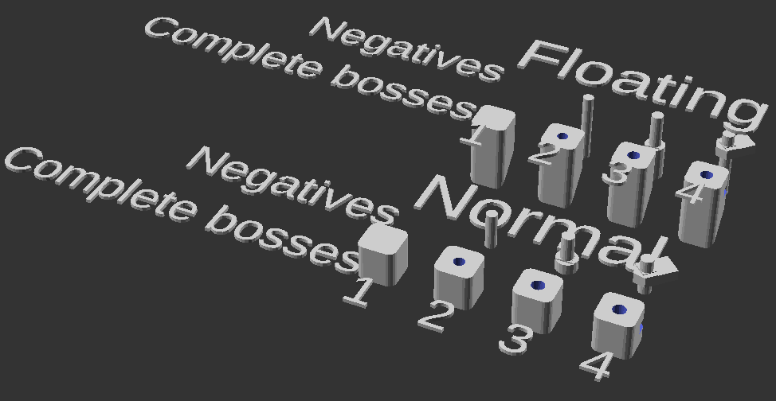
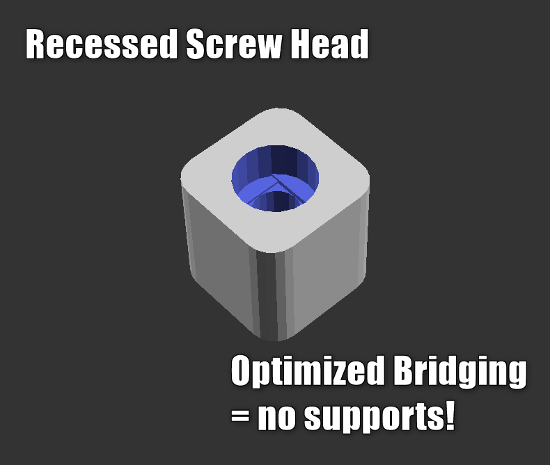
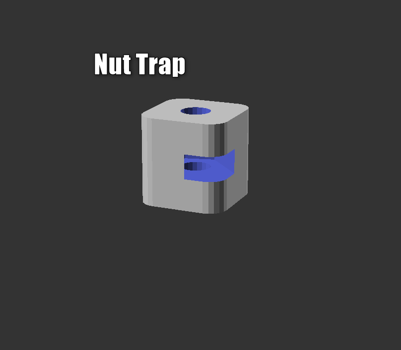
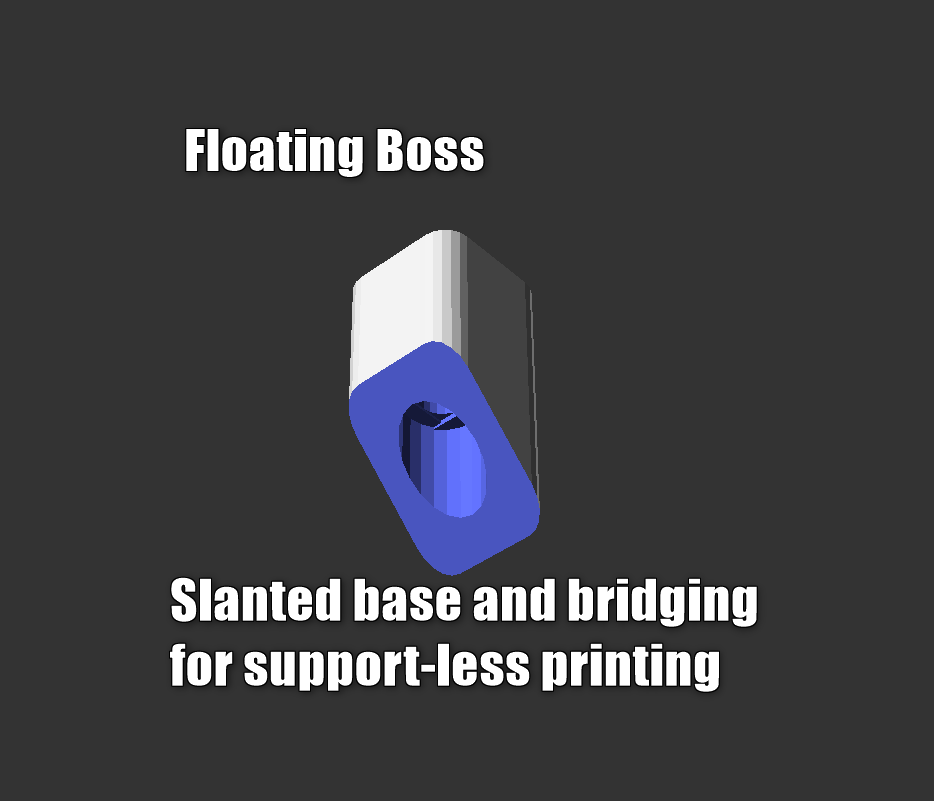
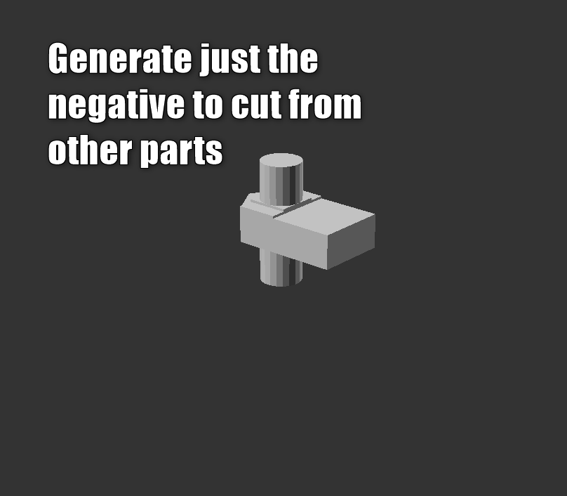

# Screw Boss OpenSCAD Library
This is a library for creating screw bosses in 3D printed parts. It serves
to generate and locate components of a typical screw cutout, including:

  - Clearance hole, where the screw can slide.
  - Interference hole, where the screw threads into the plastic.
  - Recess for the screw head (always positioned on the bottom of the boss).
  - Nut trap where a nut can be inserted to get a secure hold on a part.
  - Boss for the screw, usually filling a void in a part.
    - Tolerance hole with a (removable) captive nut.
    - Interference hole for the screw to thread into.

The above features are implemented individually as `low-level` features.
They are all located in such a manner to allow placement of any
combination of those features. They are not implemented in combination
because there are few use cases for a pre-cutout feature in OpenSCAD,
as the cutout will usually have to cut through another feature in the
main part. By default, they are place so that no translation is required
to generate a completely featured boss. 

Bosses are constructed in the 1st octant (+X+Y+Z) if isFloating=false, and 
the 5th octant (+X+Y-Z) if isFloating=true. Cutouts are located to allow
them to be immediately removed from a pre-constructed boss (every module
accepts inputs for the size of the boss that the negative is for).

Features that could result in floating surfaces (such as a reduction in
diameter from that of a screw head to just the threads) are generated with
optimized bridging to remove the need for support material while printing.

There are clearance parameters defined at the top of the library. Those
may vary by 3D printer, so feel free to fudge them to meet your needs.

There are a lot of repeated inputs required due to the limitations of
OpenSCAD to remember information, so just bear with it as you have to
provide the same parameters to each function call.

Below are some typical bosses that could be generated:

 
 
 
 
 
 
 
 
 


# Modules

- `boss(L, W, R, isFloating)` 
    - returns a WxWxL boss with radius R on vertical edges. isFloating=true 
      adds a 45deg slant to the bottom, extending beyond the specified height, L.
- `clearanceNegative(D, L, W, isFloating)`
    - returns a negative to cut a clearance hole. Uses `clearance` defined 
      at the top of the file.
- `interferenceNegative(D, L, W, isFloating)`
    - returns a negative to cut an interference hole. Uses `interference` 
      defined at the top of the file.
- `screwHeadNegative(D, H, d, W, layerHeight, isFloating)`
    - returns a negative to cut a screw head recess. Optimizes briding inside 
      so this recess can be below the smaller hole (d) on a print bed. 
- `nutTrapNegative(F, H, L, W, d, layerHeight, a, isFloating)`
    - returns a negative for a nut trap to cut out of the boss.
 
 # Example use
 ```openscad
headHeight = 3;
headDiam = 5.4;
screwLength = 10;
screwDiam = 3;
nutHeight = 2.4;
nutFlats = 5.5;
filletRadius = 2;
isFloating = true;
bossW = 10;
$fn = 20;

difference() {
  boss(W=bossW, L=screwLength, R=filletRadius, isFloating=isFloating);
  clearanceNegative(D=screwDiam, L=screwLength, W=bossW, isFloating=isFloating);
  screwHeadNegative(D=headDiam, H=headHeight, d=screwDiam, W=bossW, isFloating=isFloating, L=screwLength);
}
```